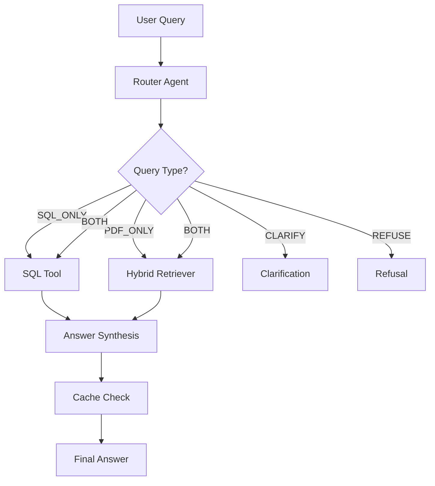

# Hybrid RAG Agent

A production-ready Hybrid RAG (Retrieval-Augmented Generation) Agent for financial intelligence. This system intelligently routes queries between structured SQL data (stock prices) and unstructured PDF documents (10-K annual reports), synthesizing answers from both sources.

## Overview

This system serves investment analysts who need to ask complex questions requiring information from two distinct sources:

1. **Structured Data**: SQLite database with historical daily stock prices
2. **Unstructured Knowledge**: 10-K Annual Reports (PDFs) with risks, strategy, and legal proceedings

The agent uses intelligent routing to determine whether a query needs SQL execution, PDF retrieval, or both, then synthesizes a coherent answer with proper citations.

## Architecture



## How a Question is Handled

1. **Routing**: The router classifies the query into one of five categories:
   - `SQL_ONLY`: Requires database lookup (e.g., "What was Tesla's closing price on June 15, 2023?")
   - `PDF_ONLY`: Requires document search (e.g., "What are Apple's main risk factors?")
   - `BOTH`: Needs both sources (e.g., "Compare Microsoft's AI risks with its stock volatility in October 2023")
   - `CLARIFY`: Ambiguous query (missing company name, date, etc.)
   - `REFUSE`: Contains dangerous SQL injection attempts

2. **Tool Execution**:
   - **SQL Tool**: Generates SQL dynamically, validates for safety (read-only, whitelist tables), executes query
   - **Hybrid Retriever**: Combines BM25 (keyword) and vector (semantic) search, optionally reranks results

3. **Answer Synthesis**: LLM synthesizes answer from retrieved context and SQL results

4. **Caching**: Results are cached semantically to avoid redundant LLM calls

## How to Run

### Prerequisites

- Python 3.11+
- Ollama installed and running (for local LLM)
- PDF files in `data/pdfs/` directory

### Step 1: Install Dependencies

```bash
pip install -r requirements.txt
```

### Step 2: Set Up Data

```bash
# Generate SQL database
python setup_data.py

# Download PDFs automatically (or manually)
python download_pdfs.py

# Or manually: Download PDFs from links printed by setup_data.py
# Place PDFs in data/pdfs/ directory
# Example filenames: AAPL_2023_10K.pdf, MSFT_2023_10K.pdf, TSLA_2023_10K.pdf
```

### Step 3: Start Ollama (if not running)

```bash
# Install Ollama: https://ollama.com
# Pull model
ollama pull llama3.1:8b
ollama pull nomic-embed-text

# Start Ollama server (usually runs automatically)
```

### Step 4: Ingest PDFs

```bash
python -m src.ingest
```

This extracts text and tables from PDFs, builds the vector index, and saves chunks.

### Step 5: Start API Server

```bash
uvicorn src.api:app --reload
```

The API will be available at `http://localhost:8000`

### Step 6: Run Evaluation (Optional)

```bash
python eval/run_eval.py
```

This runs the golden dataset and generates `eval_results.csv`.

## Example Queries

### Example 1: SQL-Only Query

**Query**: "What was the highest closing price for Tesla (TSLA) during June 2023?"

**Expected Routing**: `SQL_ONLY`

**Response**: The agent generates SQL like:
```sql
SELECT MAX(close) FROM stock_prices 
WHERE symbol='TSLA' AND date BETWEEN '2023-06-01' AND '2023-06-30'
```

### Example 2: Hybrid Query

**Query**: "Compare Microsoft's AI risk factors with its stock volatility in October 2023."

**Expected Routing**: `BOTH`

**Response**: 
- Retrieves relevant sections from Microsoft's 10-K about AI risks
- Queries database for October 2023 stock price data
- Calculates volatility
- Synthesizes comparison with citations

## API Usage

### POST /query

Query the agent with a question.

**Request**:
```json
{
  "question": "What was Apple's total net sales for fiscal year 2023?",
  "stream": false
}
```

**Response**:
```json
{
  "answer": "Apple's total net sales for fiscal year 2023 were $383.285 billion...",
  "sources": [
    {
      "type": "pdf",
      "company": "AAPL",
      "year": "2023",
      "page": "45",
      "pdf_filename": "AAPL_2023_10K.pdf"
    }
  ],
  "route": "PDF_ONLY",
  "cached": false
}
```

### Streaming (SSE)

Set `"stream": true` to receive Server-Sent Events with token-by-token streaming.

## Project Structure

```
.
├── src/
│   ├── api.py              # FastAPI endpoint
│   ├── agent_graph.py      # Agent orchestration
│   ├── cache.py            # Semantic caching
│   ├── config.py           # Configuration
│   ├── ingest.py           # PDF ingestion pipeline
│   ├── prompts.py          # LLM prompts
│   ├── retriever.py        # Hybrid retrieval (BM25 + Vector)
│   └── tools_sql.py        # SQL generation and validation
├── eval/
│   └── run_eval.py         # Evaluation script
├── data/
│   ├── finance.db          # SQLite database (generated)
│   ├── chunks.json         # Extracted chunks (generated)
│   ├── pdfs/               # PDF files (user-provided)
│   ├── vector_store/       # ChromaDB data (generated)
│   └── cache/              # Cache files (generated)
├── setup_data.py           # Database generation script
├── golden_dataset.json     # Evaluation dataset
├── run_ci.sh              # CI pipeline script
├── Dockerfile             # Docker configuration
└── requirements.txt       # Python dependencies
```

## Configuration

Environment variables (optional, defaults provided):

- `MODEL_PROVIDER`: Model provider (default: "ollama")
- `MODEL_NAME`: LLM model name (default: "llama3.1:8b")
- `MODEL_BASE_URL`: Ollama API URL (default: "http://localhost:11434")
- `EMBEDDING_MODEL`: Embedding model (default: "nomic-embed-text")
- `TOP_K_VECTOR`: Vector search top-k (default: 5)
- `TOP_K_BM25`: BM25 search top-k (default: 5)
- `USE_RERANKER`: Enable reranking (default: "false")
- `CACHE_ENABLED`: Enable semantic cache (default: "true")

## Key Features

### Table-Aware PDF Parsing

PDFs are parsed using `pdfplumber` to extract both text and tables. Tables are preserved as Markdown format, preventing arbitrary chunking that would break table structure.

### SQL Safety

- Read-only queries only (SELECT statements)
- Table/column whitelist validation
- SQL injection pattern detection
- Schema introspection for accurate SQL generation

### Hybrid Retrieval

- **BM25**: Keyword-based search for exact term matching
- **Vector**: Semantic search for conceptual similarity
- **Reranking**: Optional cross-encoder reranking (disabled by default)

### Semantic Caching

Caches query-answer pairs using embedding similarity to avoid redundant LLM calls for similar queries.

## Evaluation

The evaluation script (`eval/run_eval.py`) runs 10 golden questions and outputs `eval_results.csv` with:

- `context_precision`: Did retrieval find relevant chunks?
- `faithfulness`: Did answer hallucinate information?
- `sql_valid`: Did generated SQL execute successfully?

## Docker

Build and run with Docker:

```bash
docker build -t hybrid-rag-agent .
docker run -p 8000:8000 hybrid-rag-agent
```

**Note**: The Dockerfile includes Ollama installation. In production, you may want to run Ollama as a separate service.

## CI/CD

Run the CI pipeline:

**Linux/Mac:**
```bash
bash run_ci.sh
```

**Windows:**
```cmd
run_ci.bat
```

This script:
1. Generates database if missing
2. Builds vector index if missing
3. Runs evaluation

## Troubleshooting

### "No chunks found"

Run ingestion: `python -m src.ingest`

### "Ollama connection failed"

Ensure Ollama is running: `ollama serve` or check `MODEL_BASE_URL` in config.

### "PDF parsing errors"

Ensure PDFs are valid and placed in `data/pdfs/`. Check filenames match expected patterns.

## TODO / Future Improvements

- [ ] Replace fallback embeddings with proper embedding model
- [ ] Implement proper cross-encoder reranker
- [ ] Add Arabic translation support (bonus challenge)
- [ ] Improve semantic chunking algorithm
- [ ] Add more sophisticated LLM-as-a-judge for evaluation
- [ ] Support for additional document types
- [ ] Multi-turn conversation support

## License

This project is part of a technical assessment.
