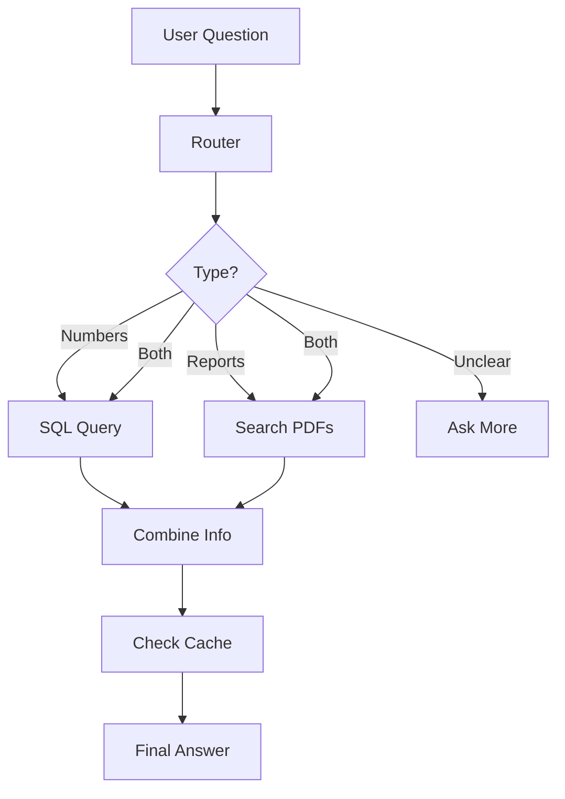

# Hybrid RAG Agent

**Built by Tasnim Ali Makableh**

Hey there! This is my take on building a Hybrid RAG (Retrieval-Augmented Generation) Agent focused on financial intelligence. Basically, it's designed to help investment analysts dig into questions that mix structured data from stock prices with unstructured info from company reports. The cool part is how it smartly decides whether to pull from a database, search PDFs, or do both, then puts together a solid answer with sources.

## What's This All About?

Imagine you're an analyst needing to know stuff like "How volatile was Tesla's stock last quarter?" or "What risks does Apple highlight in their latest 10-K?" Sometimes you need both – like comparing a company's risk factors with their actual stock performance. This agent handles that by routing queries intelligently and combining insights from:

- **Stock Data**: A SQLite database with daily prices for companies like AAPL, MSFT, TSLA
- **Reports**: 10-K annual reports in PDF form, full of strategy, risks, and legal stuff

It uses local LLMs (via Ollama) to keep things private and fast, with caching to avoid repeating work.

## How It Works (High-Level)

Basically, I created a smart system that takes a question and decides what to do with it. Here's what I built step by step:

1. **Router**: First, the question goes to a router that checks if it's about stock numbers, company reports, both, or needs clarification.
2. **Tools**: Depending on the type, it either runs a SQL query on the stock database, searches the PDF reports, or does both.
3. **Combine**: Then it puts all the info together into a clear answer.
4. **Cache**: It remembers answers to similar questions to save time.

Here's a simple diagram of the flow:



## Getting It Running

You'll need Python 3.11+, Ollama running locally, and some PDFs. Here's the step-by-step:

### 1. Grab the Dependencies
```bash
pip install -r requirements.txt
```

### 2. Set Up the Data
```bash
# Make the stock database
python setup_data.py

# Get the PDFs (it'll download automatically or tell you links)
python download_pdfs.py
```

### 3. Fire Up Ollama
If you haven't already:
```bash
# Get Ollama from ollama.com
ollama pull llama3.1:8b
ollama pull nomic-embed-text
# It should start automatically, but if not: ollama serve
```

### 4. Process the PDFs
```bash
python -m src.ingest
```
This pulls out text and tables, chunks them smartly, and builds a search index.

### 5. Launch the API
```bash
uvicorn src.api:app --reload
```
Head to http://localhost:8000 to play around.

### 6. Test It Out (Optional)
```bash
python eval/run_eval.py
```
Runs some sample questions and spits out results in a CSV.

## Try Some Queries

- **Simple Stock Question**: "What's the average price of MSFT in Q3 2023?"
  - Routes to SQL, generates a query, runs it.

- **Report Dive**: "What are Tesla's biggest risks?"
  - Searches the 10-K PDF for relevant sections.

- **Mix It Up**: "How do Apple's revenue risks compare to their stock dips in 2023?"
  - Hits both the database and PDFs, then explains with citations.

## Using the API

Hit `/query` with a POST:

```json
{
  "question": "How much did Microsoft earn last year?",
  "stream": false
}
```

Get back something like:
```json
{
  "answer": "Microsoft's revenue was $211 billion...",
  "sources": [{"type": "pdf", "company": "MSFT", "page": "30"}],
  "route": "PDF_ONLY"
}
```

Set `"stream": true` for live streaming of the response.

## Project Layout

```
.
├── src/                 # Main code
│   ├── api.py           # The web endpoint
│   ├── agent_graph.py   # How everything connects
│   ├── cache.py         # Saves repeated queries
│   ├── config.py        # Settings
│   ├── ingest.py        # PDF processing
│   ├── prompts.py       # What to tell the LLM
│   ├── retriever.py     # Searching PDFs
│   └── tools_sql.py     # Safe SQL stuff
├── eval/                # Testing
│   └── run_eval.py
├── data/                # All the data files
│   ├── finance.db       # Stock prices DB
│   ├── chunks.json      # Processed PDF bits
│   ├── pdfs/            # The actual PDFs
│   ├── vector_store/    # Search index
│   └── cache/           # Cached answers
├── setup_data.py        # Builds the DB
├── golden_dataset.json  # Test questions
├── run_ci.sh            # Quick test script
├── Dockerfile           # For containerizing
└── requirements.txt     # Python packages
```

## Tweaking Settings

You can set env vars like:
- `MODEL_NAME`: Which LLM to use (default: llama3.1:8b)
- `TOP_K_VECTOR`: How many search results (default: 5)
- `CACHE_ENABLED`: Skip repeats (default: true)

## Cool Bits I Added

- **Smart PDF Handling**: Keeps tables intact when chunking, no broken data.
- **Safe SQL**: Only reads data, checks for bad stuff, uses a whitelist.
- **Dual Search**: Keywords + meaning-based search for better finds.
- **Caching**: Remembers similar questions to speed things up.

## Testing & Evaluation

The eval script checks how well it retrieves info and answers accurately, outputting scores for precision and faithfulness.

## Docker Option

If you prefer containers:
```bash
docker build -t hybrid-rag-agent .
docker run -p 8000:8000 hybrid-rag-agent
```

## Quick CI Run

For Linux/Mac: `bash run_ci.sh`
Windows: `run_ci.bat`

Sets up data and runs tests.

## If Things Go Wrong

- **No data found?** Rerun `python -m src.ingest`
- **Ollama issues?** Make sure it's running on localhost:11434
- **PDF problems?** Double-check files are in data/pdfs/ with right names

## What's Next?

- Better embeddings and reranking
- Support for more languages (Arabic maybe?)
- Handling conversations
- More doc types

This was a fun project to build – let me know if you try it out!

### Prerequisites

- Python 3.11+
- Ollama installed and running (for local LLM)
- PDF files in `data/pdfs/` directory

### Step 1: Install Dependencies

```bash
pip install -r requirements.txt
```

### Step 2: Set Up Data

```bash
# Generate SQL database
python setup_data.py

# Download PDFs automatically (or manually)
python download_pdfs.py

# Or manually: Download PDFs from links printed by setup_data.py
# Place PDFs in data/pdfs/ directory
# Example filenames: AAPL_2023_10K.pdf, MSFT_2023_10K.pdf, TSLA_2023_10K.pdf
```

### Step 3: Start Ollama (if not running)

```bash
# Install Ollama: https://ollama.com
# Pull model
ollama pull llama3.1:8b
ollama pull nomic-embed-text

# Start Ollama server (usually runs automatically)
```

### Step 4: Ingest PDFs

```bash
python -m src.ingest
```

This extracts text and tables from PDFs, builds the vector index, and saves chunks.

### Step 5: Start API Server

```bash
uvicorn src.api:app --reload
```

The API will be available at `http://localhost:8000`

### Step 6: Run Evaluation (Optional)

```bash
python eval/run_eval.py
```

This runs the golden dataset and generates `eval_results.csv`.

## Example Queries

### Example 1: SQL-Only Query

**Query**: "What was the highest closing price for Tesla (TSLA) during June 2023?"

**Expected Routing**: `SQL_ONLY`

**Response**: The agent generates SQL like:
```sql
SELECT MAX(close) FROM stock_prices 
WHERE symbol='TSLA' AND date BETWEEN '2023-06-01' AND '2023-06-30'
```

### Example 2: Hybrid Query

**Query**: "Compare Microsoft's AI risk factors with its stock volatility in October 2023."

**Expected Routing**: `BOTH`

**Response**: 
- Retrieves relevant sections from Microsoft's 10-K about AI risks
- Queries database for October 2023 stock price data
- Calculates volatility
- Synthesizes comparison with citations

## API Usage

### POST /query

Query the agent with a question.

**Request**:
```json
{
  "question": "What was Apple's total net sales for fiscal year 2023?",
  "stream": false
}
```

**Response**:
```json
{
  "answer": "Apple's total net sales for fiscal year 2023 were $383.285 billion...",
  "sources": [
    {
      "type": "pdf",
      "company": "AAPL",
      "year": "2023",
      "page": "45",
      "pdf_filename": "AAPL_2023_10K.pdf"
    }
  ],
  "route": "PDF_ONLY",
  "cached": false
}
```

### Streaming (SSE)

Set `"stream": true` to receive Server-Sent Events with token-by-token streaming.

## Project Structure

```
.
├── src/
│   ├── api.py              # FastAPI endpoint
│   ├── agent_graph.py      # Agent orchestration
│   ├── cache.py            # Semantic caching
│   ├── config.py           # Configuration
│   ├── ingest.py           # PDF ingestion pipeline
│   ├── prompts.py          # LLM prompts
│   ├── retriever.py        # Hybrid retrieval (BM25 + Vector)
│   └── tools_sql.py        # SQL generation and validation
├── eval/
│   └── run_eval.py         # Evaluation script
├── data/
│   ├── finance.db          # SQLite database (generated)
│   ├── chunks.json         # Extracted chunks (generated)
│   ├── pdfs/               # PDF files (user-provided)
│   ├── vector_store/       # ChromaDB data (generated)
│   └── cache/              # Cache files (generated)
├── setup_data.py           # Database generation script
├── golden_dataset.json     # Evaluation dataset
├── run_ci.sh              # CI pipeline script
├── Dockerfile             # Docker configuration
└── requirements.txt       # Python dependencies
```

## Configuration

Environment variables (optional, defaults provided):

- `MODEL_PROVIDER`: Model provider (default: "ollama")
- `MODEL_NAME`: LLM model name (default: "llama3.1:8b")
- `MODEL_BASE_URL`: Ollama API URL (default: "http://localhost:11434")
- `EMBEDDING_MODEL`: Embedding model (default: "nomic-embed-text")
- `TOP_K_VECTOR`: Vector search top-k (default: 5)
- `TOP_K_BM25`: BM25 search top-k (default: 5)
- `USE_RERANKER`: Enable reranking (default: "false")
- `CACHE_ENABLED`: Enable semantic cache (default: "true")

## Key Features

### Table-Aware PDF Parsing

PDFs are parsed using `pdfplumber` to extract both text and tables. Tables are preserved as Markdown format, preventing arbitrary chunking that would break table structure.

### SQL Safety

- Read-only queries only (SELECT statements)
- Table/column whitelist validation
- SQL injection pattern detection
- Schema introspection for accurate SQL generation

### Hybrid Retrieval

- **BM25**: Keyword-based search for exact term matching
- **Vector**: Semantic search for conceptual similarity
- **Reranking**: Optional cross-encoder reranking (disabled by default)

### Semantic Caching

Caches query-answer pairs using embedding similarity to avoid redundant LLM calls for similar queries.

## Evaluation

The evaluation script (`eval/run_eval.py`) runs 10 golden questions and outputs `eval_results.csv` with:

- `context_precision`: Did retrieval find relevant chunks?
- `faithfulness`: Did answer hallucinate information?
- `sql_valid`: Did generated SQL execute successfully?

## Docker

Build and run with Docker:

```bash
docker build -t hybrid-rag-agent .
docker run -p 8000:8000 hybrid-rag-agent
```

**Note**: The Dockerfile includes Ollama installation. In production, you may want to run Ollama as a separate service.

## CI/CD

Run the CI pipeline:

**Linux/Mac:**
```bash
bash run_ci.sh
```

**Windows:**
```cmd
run_ci.bat
```

This script:
1. Generates database if missing
2. Builds vector index if missing
3. Runs evaluation

## If Things Go Wrong

- **No data found?** Rerun `python -m src.ingest`
- **Ollama issues?** Make sure it's running on localhost:11434
- **PDF problems?** Double-check files are in data/pdfs/ with right names

## What's Next?

- Better embeddings and reranking
- Support for more languages (Arabic maybe?)
- Handling conversations
- More doc types

This was a fun project to build – let me know if you try it out!
